# Zest — Global Dependency Graph

> **Last Updated:** 2026-02-22  
> **Stories Covered:** ZEST-001 → ZEST-026 (all 8 features)  
> **Machine-readable data:** [`graph.yaml`](./graph.yaml)

---

## Dependency Graph

```mermaid
graph TD
    %% ── Nodes: Feature 1 — Prompt Generation ──────────────────────────
    ZEST001["ZEST-001: Project Scaffold & Infrastructure (L1)"]:::pending
    ZEST002["ZEST-002: Design System Tokens & Base UI (L2)"]:::pending
    ZEST003["ZEST-003: Go AI Service Scaffold (L3)"]:::pending
    ZEST004["ZEST-004: Generation API Route (L3)"]:::pending
    ZEST005["ZEST-005: PromptBar Component (L4)"]:::pending
    ZEST006["ZEST-006: Generation Loader & Canvas Preview (L4)"]:::pending
    ZEST007["ZEST-007: Homepage & Generation Flow Integration (L5)"]:::pending

    %% ── Nodes: Feature 2 — Visual Editor ──────────────────────────────
    ZEST008["ZEST-008: Editor Layout Shell (L2)"]:::pending
    ZEST009["ZEST-009: Iframe Bridge & Element Selection (L4)"]:::pending
    ZEST010["ZEST-010: Properties Panel & Style Editing (L4)"]:::pending
    ZEST011["ZEST-011: Inline Text Editing (L4)"]:::pending
    ZEST012["ZEST-012: Drag-to-Reposition & Resize (L4)"]:::pending
    ZEST013["ZEST-013: Layers Panel, Delete & Undo/Redo (L4)"]:::pending

    %% ── Nodes: Feature 3 — Chat Refinement ────────────────────────────
    ZEST014["ZEST-014: Go AI Service — Refinement Scoped Prompting (L3)"]:::pending
    ZEST015["ZEST-015: Chat Panel UI & Refinement Integration (L4)"]:::pending

    %% ── Nodes: Feature 4 — Code Export ────────────────────────────────
    ZEST016["ZEST-016: Export API Route & ZIP Generation (L3)"]:::pending
    ZEST017["ZEST-017: Export Modal & Code Preview UI (L4)"]:::pending

    %% ── Nodes: Feature 5 — Authentication ─────────────────────────────
    ZEST018["ZEST-018: Clerk Auth Setup & Middleware (L1)"]:::pending
    ZEST019["ZEST-019: Clerk Webhook Handler — User Sync (L3)"]:::pending
    ZEST020["ZEST-020: Auth UI — Sign In / Sign Up Pages (L4)"]:::pending

    %% ── Nodes: Feature 6 — Project Management ─────────────────────────
    ZEST021["ZEST-021: Project CRUD API Routes (L3)"]:::pending
    ZEST022["ZEST-022: Dashboard Page & Project Cards (L4)"]:::pending
    ZEST023["ZEST-023: Auto-Save & Project State Sync (L5)"]:::pending

    %% ── Nodes: Feature 7 — Freemium Limits ────────────────────────────
    ZEST024["ZEST-024: Usage Tracking & Quota Enforcement (L3)"]:::pending
    ZEST025["ZEST-025: UpgradeWall Component & Usage Indicator (L4)"]:::pending

    %% ── Nodes: Feature 8 — Responsive Preview ─────────────────────────
    ZEST026["ZEST-026: Viewport Toggle & Canvas Resize (L4)"]:::pending

    %% ── Edges: Feature 1 ───────────────────────────────────────────────
    ZEST001 --> ZEST002
    ZEST001 --> ZEST003
    ZEST001 --> ZEST004
    ZEST003 --> ZEST004
    ZEST002 --> ZEST005
    ZEST004 --> ZEST005
    ZEST004 --> ZEST006
    ZEST005 --> ZEST006
    ZEST005 --> ZEST007
    ZEST006 --> ZEST007

    %% ── Edges: Feature 2 ───────────────────────────────────────────────
    ZEST002 --> ZEST008
    ZEST006 --> ZEST008
    ZEST008 --> ZEST009
    ZEST009 --> ZEST010
    ZEST009 --> ZEST011
    ZEST009 --> ZEST012
    ZEST010 --> ZEST013
    ZEST011 --> ZEST013
    ZEST012 --> ZEST013

    %% ── Edges: Feature 3 ───────────────────────────────────────────────
    ZEST003 --> ZEST014
    ZEST004 --> ZEST014
    ZEST008 --> ZEST015
    ZEST009 --> ZEST015
    ZEST014 --> ZEST015

    %% ── Edges: Feature 4 ───────────────────────────────────────────────
    ZEST001 --> ZEST016
    ZEST004 --> ZEST016
    ZEST008 --> ZEST017
    ZEST016 --> ZEST017

    %% ── Edges: Feature 5 ───────────────────────────────────────────────
    ZEST001 --> ZEST018
    ZEST004 --> ZEST018
    ZEST001 --> ZEST019
    ZEST018 --> ZEST019
    ZEST002 --> ZEST020
    ZEST008 --> ZEST020
    ZEST018 --> ZEST020

    %% ── Edges: Feature 6 ───────────────────────────────────────────────
    ZEST001 --> ZEST021
    ZEST004 --> ZEST021
    ZEST018 --> ZEST021
    ZEST002 --> ZEST022
    ZEST018 --> ZEST022
    ZEST021 --> ZEST022
    ZEST009 --> ZEST023
    ZEST018 --> ZEST023
    ZEST021 --> ZEST023

    %% ── Edges: Feature 7 ───────────────────────────────────────────────
    ZEST001 --> ZEST024
    ZEST004 --> ZEST024
    ZEST018 --> ZEST024
    ZEST019 --> ZEST024
    ZEST006 --> ZEST025
    ZEST008 --> ZEST025
    ZEST018 --> ZEST025
    ZEST024 --> ZEST025

    %% ── Edges: Feature 8 ───────────────────────────────────────────────
    ZEST008 --> ZEST026
    ZEST009 --> ZEST026

    %% ── Styles ─────────────────────────────────────────────────────────
    classDef pending fill:#fff,stroke:#ccc,stroke-width:1px,color:#333;
    classDef done fill:#d4f0e0,stroke:#22c55e,stroke-width:2px,color:#166534;
```



---

## Story Index

| ID | Title | Layer | Epic | Status |
|----|-------|-------|------|--------|
| ZEST-001 | Project Scaffold & Infrastructure | L1-data | ZEST-F01 | pending |
| ZEST-002 | Design System Tokens & Base UI | L2-ui-foundation | ZEST-F01 | pending |
| ZEST-003 | Go AI Service Scaffold | L3-backend | ZEST-F01 | pending |
| ZEST-004 | Generation API Route (Next.js) | L3-backend | ZEST-F01 | pending |
| ZEST-005 | PromptBar Component | L4-feature-ui | ZEST-F01 | pending |
| ZEST-006 | Generation Loader & Canvas Preview | L4-feature-ui | ZEST-F01 | pending |
| ZEST-007 | Homepage & Generation Flow Integration | L5-integration | ZEST-F01 | pending |
| ZEST-008 | Editor Layout Shell | L2-ui-foundation | ZEST-F02 | pending |
| ZEST-009 | Iframe Bridge & Element Selection | L4-feature-ui | ZEST-F02 | pending |
| ZEST-010 | Properties Panel & Style Editing | L4-feature-ui | ZEST-F02 | pending |
| ZEST-011 | Inline Text Editing | L4-feature-ui | ZEST-F02 | pending |
| ZEST-012 | Drag-to-Reposition & Resize | L4-feature-ui | ZEST-F02 | pending |
| ZEST-013 | Layers Panel, Delete & Undo/Redo | L4-feature-ui | ZEST-F02 | pending |
| ZEST-014 | Go AI Service — Refinement Scoped Prompting | L3-backend | ZEST-F03 | pending |
| ZEST-015 | Chat Panel UI & Refinement Integration | L4-feature-ui | ZEST-F03 | pending |
| ZEST-016 | Export API Route & ZIP Generation | L3-backend | ZEST-F04 | pending |
| ZEST-017 | Export Modal & Code Preview UI | L4-feature-ui | ZEST-F04 | pending |
| ZEST-018 | Clerk Auth Setup & Middleware | L1-data | ZEST-F05 | pending |
| ZEST-019 | Clerk Webhook Handler — User Sync | L3-backend | ZEST-F05 | pending |
| ZEST-020 | Auth UI — Sign In / Sign Up Pages | L4-feature-ui | ZEST-F05 | pending |
| ZEST-021 | Project CRUD API Routes | L3-backend | ZEST-F06 | pending |
| ZEST-022 | Dashboard Page & Project Cards | L4-feature-ui | ZEST-F06 | pending |
| ZEST-023 | Auto-Save & Project State Sync | L5-integration | ZEST-F06 | pending |
| ZEST-024 | Usage Tracking & Quota Enforcement | L3-backend | ZEST-F07 | pending |
| ZEST-025 | UpgradeWall Component & Usage Indicator | L4-feature-ui | ZEST-F07 | pending |
| ZEST-026 | Viewport Toggle & Canvas Resize | L4-feature-ui | ZEST-F08 | pending |

---

## Critical Path

The longest dependency chain from root to leaf:

```
ZEST-001 → ZEST-003 → ZEST-004 → ZEST-014 → ZEST-015
                               ↘
         → ZEST-018 → ZEST-019 → ZEST-024 → ZEST-025
```

**Minimum 5 sequential layers** must complete before ZEST-025 can begin.

---

## Ready to Start (no unmet dependencies)

These stories have no dependencies and can begin immediately:

| ID | Title |
|----|-------|
| **ZEST-001** | Project Scaffold & Infrastructure |

> All other stories depend (directly or transitively) on ZEST-001.

---

## Parallelization Opportunities

Once ZEST-001 is complete, the following can be worked in parallel:

| Parallel Track | Stories |
|----------------|---------|
| **Track A — AI Engine** | ZEST-003 → ZEST-004 → ZEST-014 |
| **Track B — UI Foundation** | ZEST-002 → ZEST-005, ZEST-008 |
| **Track C — Auth** | ZEST-018 → ZEST-019, ZEST-020 |

Once ZEST-004 + ZEST-003 complete, ZEST-014 and ZEST-016 can run in parallel. Once ZEST-008 + ZEST-009 complete, ZEST-010, ZEST-011, ZEST-012 can all run in parallel.
