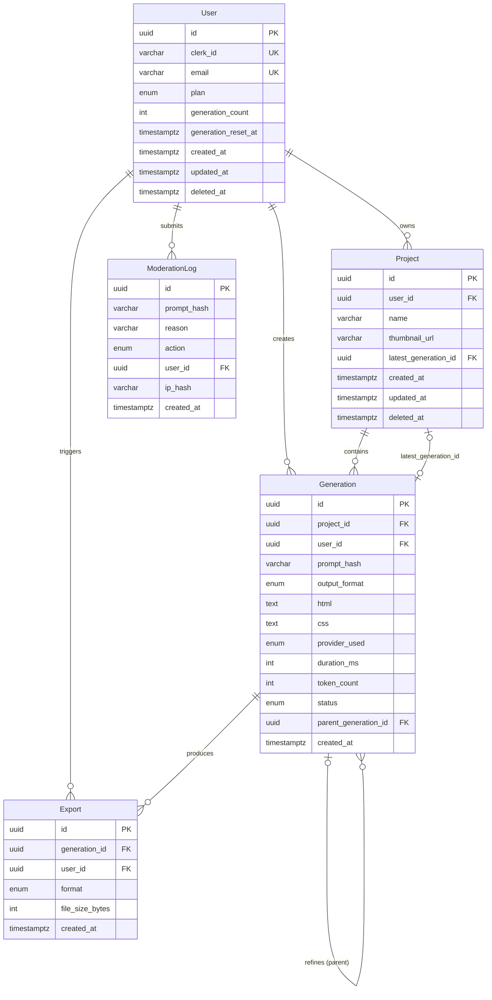

# Entity Relationship Diagram

**Project:** Zest — AI-powered UI Builder
**Scope:** Core (System-wide)
**Date:** 2026-02-22
**Source Documents:** `docs/fsd.md` §4 (Data Dictionary), `docs/prd.md`
**Status:** Approved

---

## 1. Entity Catalog

| Entity Name | Description | Type | Primary Key |
|-------------|-------------|------|-------------|
| `User` | Authenticated user account synced from Clerk | Strong | `id` (uuid) |
| `Project` | A named workspace owned by a user, containing generations | Strong | `id` (uuid) |
| `Generation` | A single AI-generated HTML/CSS output | Strong | `id` (uuid) |
| `Export` | A download artifact produced from a generation | Weak (depends on Generation) | `id` (uuid) |
| `ModerationLog` | Audit record of content policy decisions | Strong | `id` (uuid) |

---

## 2. Entity Details

---

### User

**Description:** Represents an authenticated user. Created via Clerk webhook. Anonymous users are NOT persisted here — they are tracked ephemerally in Redis.

**Type:** Strong Entity

**Attributes:**

| Attribute | Data Type | Constraints | Description |
|-----------|-----------|-------------|-------------|
| `id` | `uuid` | PK, NOT NULL | Internal user identifier |
| `clerk_id` | `varchar(255)` | UNIQUE, NOT NULL | External Clerk user ID |
| `email` | `varchar(255)` | UNIQUE, NOT NULL | User's email address |
| `plan` | `enum('free','paid')` | NOT NULL, DEFAULT 'free' | Subscription tier |
| `generation_count` | `integer` | NOT NULL, DEFAULT 0 | Generations used in current billing month |
| `generation_reset_at` | `timestamptz` | NOT NULL | UTC timestamp when monthly counter resets |
| `created_at` | `timestamptz` | NOT NULL | Account creation timestamp |
| `updated_at` | `timestamptz` | NOT NULL | Last record modification timestamp |
| `deleted_at` | `timestamptz` | NULLABLE | Soft delete timestamp; triggers 30-day data purge |

**Business Rules:**
- `generation_count` is reset to 0 when `NOW() >= generation_reset_at`; `generation_reset_at` advances by 1 calendar month (BR-002)
- `plan = 'free'` → limit 20 generations/month; `plan = 'paid'` → unlimited (BR-002)
- A `deleted_at` value queues a background job to permanently delete all associated data within 30 days (BR-016)
- User records are created exclusively via the `user.created` Clerk webhook (§7.1)

---

### Project

**Description:** A named container for a user's work. A project holds the series of generations produced for a given design brief.

**Type:** Strong Entity

**Attributes:**

| Attribute | Data Type | Constraints | Description |
|-----------|-----------|-------------|-------------|
| `id` | `uuid` | PK, NOT NULL | Project identifier |
| `user_id` | `uuid` | FK → User.id, NOT NULL | Owning user |
| `name` | `varchar(100)` | NOT NULL | Display name (alphanumeric, spaces, hyphens, underscores) |
| `thumbnail_url` | `varchar(500)` | NULLABLE | URL of auto-generated canvas screenshot thumbnail |
| `latest_generation_id` | `uuid` | FK → Generation.id, NULLABLE | Points to the currently active generation for display |
| `created_at` | `timestamptz` | NOT NULL | — |
| `updated_at` | `timestamptz` | NOT NULL | — |
| `deleted_at` | `timestamptz` | NULLABLE | Soft delete |

**Business Rules:**
- `latest_generation_id` is updated whenever a new generation is successfully associated with this project
- `name` must match pattern `^[a-zA-Z0-9 _-]+$`; 1–100 chars (BR / validation §6.1)
- Only `free_user` and `paid_user` roles can create projects; anonymous users cannot (Permission Matrix §2.2)
- Auto-save writes to this record every 60 seconds for authenticated users (BR-020)

---

### Generation

**Description:** A single AI-generated HTML/CSS output produced from one user prompt. Supports a self-referential parent chain for refinements.

**Type:** Strong Entity

**Attributes:**

| Attribute | Data Type | Constraints | Description |
|-----------|-----------|-------------|-------------|
| `id` | `uuid` | PK, NOT NULL | Generation identifier |
| `project_id` | `uuid` | FK → Project.id, NULLABLE | Associated project (NULL for anonymous session generations) |
| `user_id` | `uuid` | FK → User.id, NULLABLE | Owning user (NULL for anonymous) |
| `prompt_hash` | `varchar(64)` | NOT NULL | SHA-256 hash of the normalized prompt (raw prompt NOT stored — BR-014) |
| `output_format` | `enum('html_css','tailwind')` | NOT NULL | Output format requested |
| `html` | `text` | NOT NULL | Generated HTML content |
| `css` | `text` | NULLABLE | Generated CSS (NULL when output_format = 'tailwind') |
| `provider_used` | `enum('glm','gemini','github_copilot')` | NOT NULL | LLM provider that served this request |
| `duration_ms` | `integer` | NOT NULL | End-to-end generation latency in milliseconds |
| `token_count` | `integer` | NULLABLE | Number of LLM tokens consumed |
| `status` | `enum('success','failed','moderated')` | NOT NULL | Final generation outcome |
| `parent_generation_id` | `uuid` | FK → Generation.id, NULLABLE | Parent generation for refinement chains (self-reference) |
| `created_at` | `timestamptz` | NOT NULL | — |

**Business Rules:**
- Raw prompt text is NEVER stored; only `prompt_hash` is persisted (BR-014)
- `status = 'moderated'` means the content policy blocked the prompt; a `ModerationLog` entry is also created (BR-004)
- Cached results (Redis, 1-hour TTL) are keyed on `prompt_hash + output_format`; cache hits bypass LLM calls but still create a Generation record (BR-007, BR-008)
- `parent_generation_id` is NULL for initial generations; set to the preceding generation's ID for every chat refinement (BR-021)
- Generations with `project_id = NULL` are considered ephemeral; they may be cleaned up by a scheduled job

---

### Export

**Description:** A download artifact — a ZIP file containing the exported code from a generation. Weak entity: an Export cannot exist without a Generation.

**Type:** Weak Entity (depends on: `Generation`)

**Attributes:**

| Attribute | Data Type | Constraints | Description |
|-----------|-----------|-------------|-------------|
| `id` | `uuid` | PK, NOT NULL | Export identifier |
| `generation_id` | `uuid` | FK → Generation.id, NOT NULL | Source generation |
| `user_id` | `uuid` | FK → User.id, NULLABLE | User who triggered the export (NULL for anonymous) |
| `format` | `enum('html_css','tailwind')` | NOT NULL | Exported code format |
| `file_size_bytes` | `integer` | NOT NULL | Size of the produced ZIP archive in bytes |
| `created_at` | `timestamptz` | NOT NULL | — |

**Business Rules:**
- Anonymous users can export HTML/CSS only with a watermark comment; `tailwind` export is blocked for anonymous users (Permission Matrix §2.2)
- Tailwind export requires `plan = 'free'` or `plan = 'paid'`; anonymous is denied (BR / Permission Matrix)
- Exported HTML SHALL include `<meta charset="UTF-8">` and `<meta name="viewport">` (BR-012)
- Exported code SHALL be human-readable (not minified) (BR-013)

---

### ModerationLog

**Description:** Immutable audit record created whenever the content moderator in the Go AI Service makes a decision (block, allow, or escalate for review).

**Type:** Strong Entity

**Attributes:**

| Attribute | Data Type | Constraints | Description |
|-----------|-----------|-------------|-------------|
| `id` | `uuid` | PK, NOT NULL | Log identifier |
| `prompt_hash` | `varchar(64)` | NOT NULL | SHA-256 hash of the flagged prompt |
| `reason` | `varchar(255)` | NOT NULL | Category or description of why it was flagged |
| `action` | `enum('blocked','allowed','reviewed')` | NOT NULL | Outcome of the moderation check |
| `user_id` | `uuid` | FK → User.id, NULLABLE | User who submitted the prompt (NULL for anonymous) |
| `ip_hash` | `varchar(64)` | NULLABLE | Hashed IP address for rate-of-abuse analysis (raw IP NOT stored) |
| `created_at` | `timestamptz` | NOT NULL | — |

**Business Rules:**
- Only `admin` role can query ModerationLog via admin dashboard (Permission Matrix §2.2)
- `ip_hash` stores a hashed IP only, never the raw IP address (privacy / GDPR — BR-014 spirit)
- Records are IMMUTABLE — no UPDATE or DELETE operations; audit integrity is essential
- A log entry is created for EVERY moderation decision, including `allowed` (for audit trail)

---

## 3. Relationship Specifications

| Relationship | Entity A | Entity B | Cardinality | Participation | Description |
|---|---|---|---|---|---|
| owns | `User` | `Project` | 1:N | Partial (A), Total (B) | A user owns zero or more projects; each project belongs to exactly one user |
| creates | `User` | `Generation` | 1:N | Partial (A), Partial (B) | A user creates zero or more generations; anonymous generations have no user |
| triggers | `User` | `Export` | 1:N | Partial (A), Partial (B) | A user triggers zero or more exports; anonymous exports have no user |
| submits | `User` | `ModerationLog` | 1:N | Partial (A), Partial (B) | A user's prompt may appear in zero or more moderation logs; anonymous logs have no user |
| contains | `Project` | `Generation` | 1:N | Partial (A), Partial (B) | A project contains zero or more generations; a generation may belong to zero or one project |
| references (active) | `Project` | `Generation` | 1:1 | Partial (A), Partial (B) | A project optionally points to one `latest_generation_id` |
| produces | `Generation` | `Export` | 1:N | Partial (A), Total (B) | A generation can produce zero or more exports; every export comes from exactly one generation |
| refines | `Generation` | `Generation` | 1:N (self) | Partial (A), Partial (B) | A generation may be the parent of zero or more refinement generations |

---

## 4. ERD Diagram (Mermaid)

---

## 5. Design Decisions & Notes

### 5.1 Anonymous Users Not Persisted
Anonymous user sessions are tracked entirely in **Redis** (keyed by IP + browser fingerprint), not in the `User` table. This satisfies BR-017 (48-hour auto-purge) without any database cleanup jobs. The FK fields `user_id` on `Generation`, `Export`, and `ModerationLog` are all NULLABLE to accommodate anonymous records.

### 5.2 Raw Prompts Never Stored (Privacy by Design)
In compliance with BR-014 (GDPR data minimization), only the SHA-256 hash of the normalized prompt is stored. This is sufficient for deduplication and cache keying (Redis cache key = `prompt_hash:output_format`) without exposing user intent in the database.

### 5.3 Refinement Chain via Self-Reference
`Generation.parent_generation_id` creates a linked list of refinements. This design:
- Is simple to query (traverse up or down the chain)
- Supports UI history breadcrumbs
- Does NOT create a circular reference constraint (a generation cannot be its own parent — enforced at application layer)

### 5.4 Soft Delete Strategy
`User` and `Project` use `deleted_at` for soft deletes. `Generation`, `Export`, and `ModerationLog` do NOT have `deleted_at` because:
- `Generation` records are needed for cache references and audit
- `Export` records are needed for billing audits
- `ModerationLog` is immutable by design

### 5.5 Intentional Denormalization: `generation_count` on User
`User.generation_count` is a counter cache — a denormalized summary of how many generations a user has made in the current billing month. This avoids a `COUNT(*)` query on `Generation` for every request. The tradeoff (counter drift on failure) is acceptable given the non-financial nature of this limit.

### 5.6 No Session Entity in PostgreSQL
The FSD architecture diagram shows a `sessions` table concept, but sessions are managed by **Clerk** externally and cached in **Redis**. There is no `Session` entity in PostgreSQL. If session history analytics are needed later, this entity can be added.

### 5.7 No M:N Relationships
There are no many-to-many relationships in the current model. All relationships are 1:N or 1:1 optional. No junction tables are required.

---

## 6. Index Recommendations

| Table | Index | Type | Rationale |
|-------|-------|------|-----------|
| `User` | `clerk_id` | UNIQUE B-tree | Clerk webhook lookup is the primary user access pattern |
| `User` | `email` | UNIQUE B-tree | Auth lookup |
| `Project` | `user_id` | B-tree | Dashboard: list all projects for a user |
| `Project` | `deleted_at` | Partial B-tree (WHERE NULL) | Exclude soft-deleted in all queries |
| `Generation` | `project_id, created_at DESC` | Composite B-tree | List generations for a project, newest first |
| `Generation` | `user_id, created_at DESC` | Composite B-tree | Usage analytics per user |
| `Generation` | `prompt_hash, output_format` | Composite B-tree | Cache lookup deduplication |
| `Export` | `generation_id` | B-tree | List exports for a generation |
| `ModerationLog` | `created_at DESC` | B-tree | Admin queue: newest flagged content first |
| `ModerationLog` | `action` | B-tree | Filter by moderation outcome |

---

## 7. Document History

| Version | Date | Author | Changes |
|---------|------|--------|---------|
| 1.0 | 2026-02-22 | AI Assistant | Initial version — derived from FSD §4 |

---

*This ERD is the authoritative data model for Zest. All schema migrations (Prisma) must be consistent with this document. Feature-specific entities are defined in their respective feature ERD addendums (`docs/features/[feature]/erd.md`).*
