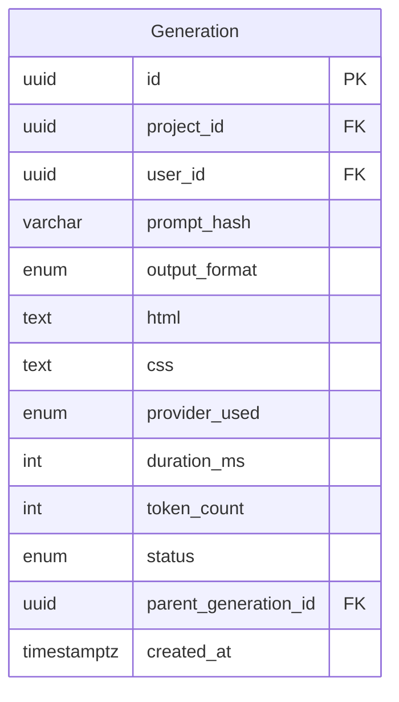

# PRD Addendum: Prompt-to-UI Generation

**Feature:** `prompt-generation`
**Epic:** ZEST-F01
**Parent PRD:** `docs/prd.md`
**Feature List:** `docs/features/feature-list.md`
**Status:** Approved
**Date:** 2026-02-22
**Priority:** P0

---

## 1. Feature Metadata

| Field | Value |
|-------|-------|
| Feature Name | Prompt-to-UI Generation |
| Feature Slug | `prompt-generation` |
| Epic Code | `ZEST-F01` |
| Priority | P0 — Must have for launch |
| Impacted Users | All (anonymous + free + paid) |
| PRD Stories | US-01, US-02, US-03 |

---

## 2. User Stories

| ID | User Story | Acceptance Criteria | Priority |
|----|------------|---------------------|----------|
| US-01 | As a user, I want to describe a UI in plain English so that I can generate a starting point without coding | **Given** I am on the homepage<br>**When** I enter a prompt (≥ 10 chars) and click "Generate"<br>**Then** within 30 seconds I see a `GenerationLoader` and then a preview of the generated UI in the canvas | P0 |
| US-02 | As a user, I want to see a preview of the generated UI so that I can evaluate if it meets my needs | **Given** generation is complete<br>**When** the result loads<br>**Then** I see the full generated interface rendered in a sandboxed `<iframe>` canvas | P0 |
| US-03 | As a user, I want to regenerate if the output isn't right so that I can get a better result | **Given** I have a generated UI<br>**When** I click "Regenerate"<br>**Then** a new generation request is submitted and the canvas updates with the new result | P1 |

---

## 3. Functional Requirements

### 3.1 PromptBar Component
- Full-width textarea that auto-grows with content
- Animated cycling placeholder suggestions (3-second cycle, 400ms cross-fade)
- Format toggle: `HTML/CSS` | `Tailwind CSS` (default: `HTML/CSS`)
- Character counter appears when prompt reaches 80% of 2,000-char limit
- Submit button with loading state (spinner + disabled) during generation
- Keyboard shortcut: `Cmd/Ctrl + Enter` submits

### 3.2 Generation Request Flow
1. Frontend validates prompt locally (min 10 chars, max 2,000 chars)
2. `POST /api/v1/generate` with `{ prompt, output_format, previous_generation_id? }`
3. Next.js middleware: Clerk JWT check → rate limit check (Redis/PostgreSQL) → Zod validation
4. Next.js API route proxies to Go AI Service: `POST {go_url}/generate`
5. Go AI Service: sanitize → moderate → select provider → call LLM → normalize → return
6. Next.js API route: save `Generation` record → return `{ html, css, generation_id }` to client
7. Client renders HTML in sandboxed `<iframe>`

### 3.3 GenerationLoader
- Replaces canvas while generating
- Animated green gradient mesh background (8s loop)
- Cycling status messages: "Thinking...", "Laying out...", "Styling...", "Adding the final touches..."
- Indeterminate green progress ring
- "Taking too long? Cancel" link appears after 15 seconds
- Cancel triggers `AbortController` on the fetch request

### 3.4 Rate Limiting Enforcement
- **Anonymous:** 3 generations per 24 hours (tracked in Redis by IP+fingerprint)
  - On limit: return `429 RATE_LIMIT_EXCEEDED`; client shows `UpgradeWall` variant: "Sign up for 20 free generations/month"
- **Free user:** 20 generations per calendar month (tracked in PostgreSQL `User.generation_count`)
  - On limit: return `429 RATE_LIMIT_EXCEEDED`; client shows `UpgradeWall` variant: "Upgrade for unlimited"
- **Paid user:** No limit enforced

### 3.5 LLM Provider Strategy (Go AI Service)
- Provider order: GLM → Gemini → GitHub Copilot
- Automatic fallback on provider error (max 3 attempts — BR-006)
- Timeout per attempt: 60 seconds total (BR-003)
- Content moderation runs before first LLM call (BR-004); if blocked → `422 CONTENT_MODERATED`

### 3.6 Output Caching (Go AI Service + Redis)
- Cache key: `SHA-256(normalized_prompt):output_format`
- TTL: 1 hour (BR-007)
- Cache hits do NOT count against usage quota (optimization — reduces LLM cost)
- Cache hits still create a `Generation` record (for audit, with same HTML/CSS)

### 3.7 Regenerate (US-03)
- "Regenerate" button visible in editor toolbar after first generation
- Submits same prompt + `output_format` as a fresh request (cache bypassed via `no_cache: true` flag)
- If project exists, previous generation preserved in the chain (`parent_generation_id = null` for fresh regenerate)

---

## 4. ERD Delta

No new entities required. Uses existing `Generation` entity from Core ERD.



---

## 5. API Contract

### POST /api/v1/generate

**Description:** Submit a prompt for AI generation. Rate-limited per tier.

**Auth:** Optional (Clerk JWT). Anonymous allowed with IP rate limit.

**Request:**
```json
{
  "prompt": "string (10–2000 chars)",
  "output_format": "html_css | tailwind",
  "previous_generation_id": "uuid | null"
}
```

**Response 201:**
```json
{
  "data": {
    "generation_id": "uuid",
    "html": "string",
    "css": "string | null",
    "provider_used": "glm | gemini | github_copilot",
    "duration_ms": 12500,
    "cached": false
  }
}
```

**Error Codes:**
| HTTP | Code | Condition |
|------|------|-----------|
| 400 | `VALIDATION_ERROR` | Prompt too short/long; invalid `output_format` |
| 422 | `CONTENT_MODERATED` | Prompt blocked by content policy |
| 429 | `RATE_LIMIT_EXCEEDED` | Anonymous daily limit or free monthly limit hit |
| 503 | `AI_SERVICE_UNAVAILABLE` | All 3 LLM providers failed |
| 504 | `GENERATION_TIMEOUT` | 60-second timeout exceeded |

---

## 6. Analytics Events

| Event | Trigger | Properties |
|-------|---------|------------|
| `prompt_submitted` | User clicks Generate | `prompt_length`, `prompt_hash`, `output_format`, `session_id`, `user_type` |
| `generation_started` | API call begins | `request_id`, `output_format`, `user_type` |
| `generation_completed` | Result returned | `request_id`, `duration_ms`, `token_count`, `provider_used`, `cached`, `success` |
| `generation_failed` | Error returned | `request_id`, `error_code`, `error_type` |
| `generation_cancelled` | User cancels after 15s | `request_id`, `elapsed_ms` |
| `regenerate_clicked` | User clicks Regenerate | `project_id`, `previous_generation_id` |

---

## 7. Open Questions

| ID | Question | Owner | Status |
|----|----------|-------|--------|
| PG-OQ-01 | Should cache hits count against the usage quota? (Currently assumed: No) | Product | Open |
| PG-OQ-02 | Should the "Regenerate" button preserve the previous generation in history? | Product | Open |
| PG-OQ-03 | Exact anonymous tracking: IP-only vs IP+fingerprint? (GDPR implication) | Legal/Tech | Open |

---

## 8. Document History

| Version | Date | Author | Changes |
|---------|------|--------|---------|
| 1.0 | 2026-02-22 | AI Assistant | Initial version |
